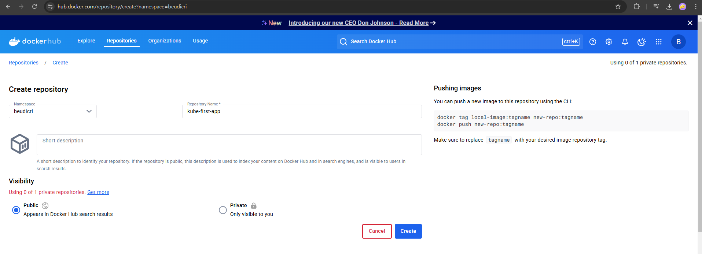
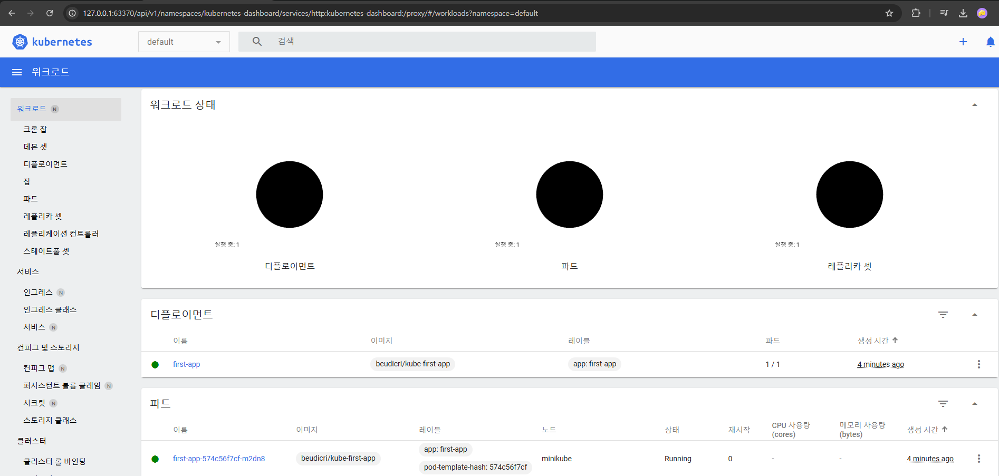
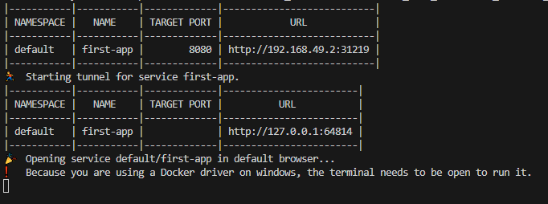
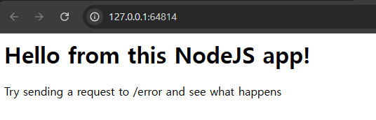
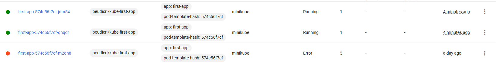
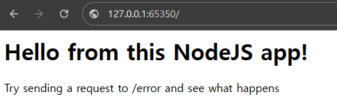
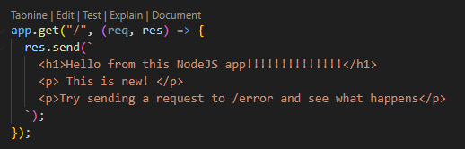
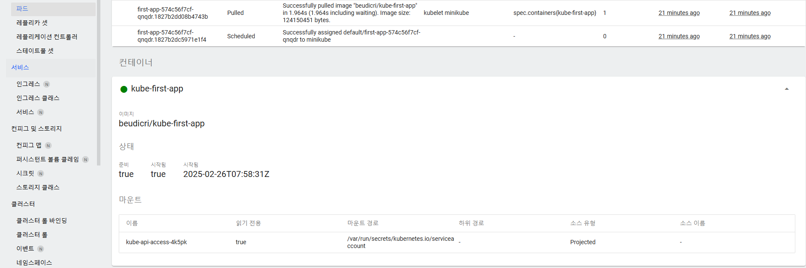

# 실습 명령어 정리

- 도커 빌드

  - `docker build -t kube-first-app .`

- 이미지 빌드 완료 후 이미지를 쿠버네티스 클러스터로 보내기위한 사전 작업
- 클러스터가 실행중인지 확인

  - `minikube status`

- 실행중이지 않다면

  - `minikube start --driver=<driver name>`
  - `minikube start --driver=docker`
  - driver name = (docker, virtualbox, hiperv(윈도우에서 가능), etc..)

- 클러스터에 Deployment를 생성하라는 명령 보내기 (명령형 방식)

  - 실행할 수 있는 명령 모음 : `kubectl help`
  - Deployment 객체 생성 : `kubectl create deployment <name> <--image 옵션>`
    - `name` : 쿠버네티스 Deployment 객체 이름
    - `--image` : Pod의 컨테이너에 사용할 이미지 지정에 사용하는 옵션 (방금 만든 이미지)
    - `kubectl create deployment first-app --image=kube-first-app`
      - `deployment.apps/first-app created`가 출력되지만
      - `kubectl get deployments` 명령을 통해 확인하면
        | NAME | READY | UP-TO-DATE | AVAILABLE | AGE |
        |---------- | ----- | ----------- | --------- | -----|
        | first-app | 0/1 | 1 | 0 | 34s |
      - `READY` : 1개의 Deployment가 실패했다는 의미
        - (0 : current state / 1 : target state)
      - `kubectl get pods` : deployment에서 생성된 모든 pod를 보기
        | NAME | READY | STATUS | RESTARTS | AGE |
        |--------- | ----- | ------ | ----- | -----|
        | first-app-9f9b6f9c7-zbr25 | 0/1 | ImagePullBackOff | 0 | 4m38s |
        - `ImagePullBackOff 에러 발생`
        - 이유 : `kubectl create deployment first-app --image=kube-first-app`에서 이미지는 로컬머신에서만 존재하며 `쿠버네티스 클러스터`에는 존재하지 않음
        - 따라서, Docker Hub와 같은 이미지 레지스트리의 일부분인 이미지를 지정해야 한다.
  - Deployment 객체 삭제 : `kubectl delete deployment first-app`
  - 도커 허브 리포지토리 생성 : 
    - 허브에 이미지 업로드
      - tag 변경 : `docker tag kube-first-app beudicri/kube-first-app`
      - 허브에 업로드 : `docker push beudicri/kube-first-app`
  - 다시 Deployment 생성

    - Docker Hub 이미지 사용 : `kubectl create deployment first-app --image=beudicri/kube-first-app`
    - `kubectl get deployments` 명령을 통해 확인하면 정상 작동
      | NAME | READY | UP-TO-DATE | AVAILABLE | AGE |
      | --------- | ----- | ---------- | --------- | --- |
      | first-app | 1/1 | 1 | 0 | 34s |
    - `kubectl get pods` : deployment에서 생성된 모든 pod도 정상 작동

      | NAME                       | READY | STATUS  | RESTARTS | AGE  |
      | -------------------------- | ----- | ------- | -------- | ---- |
      | first-app-574c56f7cf-m2dn8 | 1/1   | Running | 0        | 106s |

    - `minikube dashboard`로 확인
      

---

- Service로 Deployment 노출하기

  - `kubectl create service`로 해도 되지만 더 편리한 방법
  - `kubectl expose deployment <deployment name> --type=<type name> --port=<port number>`
    - 서비스를 생성하여 deployment에 의해 생성된 pod를 노출
    - `kubectl expose deployment first-app --type=LoadBalancer --port=8080`
    - type : 서비스의 유형 4가지
      - `ClusterIP` : (default) 클러스터 내부에서만 접근 가능
      - `NodePort` : 외부에서 노드의 IP의 특정 포트로 들어오는 요청을 감지하여 해당 포트와 연결된 Pod로 트래픽을 전달
      - `LoadBalancer` :
        - Service에 대한 고유한 주소를 생성
        - 들어오는 트래픽을 이 service의 일부인 pod에 고르게 분배
        - 별도의 외부 로드밸런서를 제공하는 클라우드 환경을 고려하여, 해당 로드 밸런서를 클러스터의 서비스로 프로비저닝 할 수 있는 유형
      - `ExternalName` : 서비스에 selector 대신 DNS name을 직접 명시하고자할 때 사용
  - `kubectl get services`로 확인
    | NAME | TYPE | CLUSTER_IP | EXTERNAL-IP | PORT(S) | AGE |
    | -------------------------- | ----- | ------- | -------- | ---- | ---- |
    |first-app | LoadBalancer | 10.110.133.163 | `<pending>` | 8080:31219/TCP | 9s|
    |kubernetes | ClusterIP | 10.96.0.1 | `<none>` | 443/TCP | 9h |
    - kubernetes : 기본으로 생성되는 service
    - `<pending>` : 클라우드 프로바이더에 배포되면 실제 외부 IP를 확인할 수 있지만  
      minikube에서는 `pending`이라고 나옴 (minikube가 로컬에서 실행되는 가상머신이기 때문)
    - 따라서, minikube에서 제공하는 명령어를 사용해 접근해야한다.
      - `minikube service first-app`
        
        

- 실제 스케일링 (scaling)

  - `kubectl scale deployment/first-app --replicas=3`

    | NAME                       | READY | STATUS  | RESTARTS     | AGE   |
    | -------------------------- | ----- | ------- | ------------ | ----- |
    | first-app-574c56f7cf-jdm54 | 1/1   | Running | 1 (4m5s ago) | 8m34s |
    | first-app-574c56f7cf-m2dn8 | 1/1   | Running | 4 (4m4s ago) | 26h   |
    | first-app-574c56f7cf-qnqdr | 1/1   | Running | 1 (4m5s ago) | 8m34s |

    - `replicas`는 pod의 실제 인스턴스 (3개 복제)
      
      
      - `/error`를 통해 종료되었지만, 다른 pod로 트래픽이 분산되어서 (LoadBalancing되어서) 정상적으로 작동 화면이 나온다.

  - `kubectl scale deployment/first-app --replicas=1` (축소도 가능)

    - 1개를 제외한 나머지가 `Treminating`상태가 됨. (시간이 지나면 사라진다.)

    | NAME                       | READY | STATUS        | RESTARTS     | AGE   |
    | -------------------------- | ----- | ------------- | ------------ | ----- |
    | first-app-574c56f7cf-jdm54 | 1/1   | `Terminating` | 1 (4m5s ago) | 8m34s |
    | first-app-574c56f7cf-m2dn8 | 1/1   | `Terminating` | 4 (4m4s ago) | 26h   |
    | first-app-574c56f7cf-qnqdr | 1/1   | Running       | 1 (4m5s ago) | 8m34s |

- Deployment 업데이트 하기
  - 소스코드 수정
    
  - 도커 이미지 재빌드 : `docker build -t beudicri/kube-first-app .`
    - 태그 명시 해줘야함(:2) : `docker build -t beudicri/kube-first-app:2 .`
    - 안해주면 기존 이미지와 현재 변경된 이미지가 같은 이름이라 적용이 안됨.
  - 도커 이미지 Docker hub에 푸시 : `docker push beudicri/kube-first-app`
    - `docker push beudicri/kube-first-app:2`
  - Deployment가 여전히 존재하는지 확인 : `kubectl get deployments`
  - 이미지 재설정 : `kubectl set image deployment/<deployment name> <container name>=<image name>`
  - `kubectl set image deployment/first-app kube-first-app=beudicri/kube-first-app:2`
    - deployment/first-app의 container를 image로 변경하겠다.
    - 이때, `태그 주의`
      
    - 변경이 잘 수행되었다.
      
